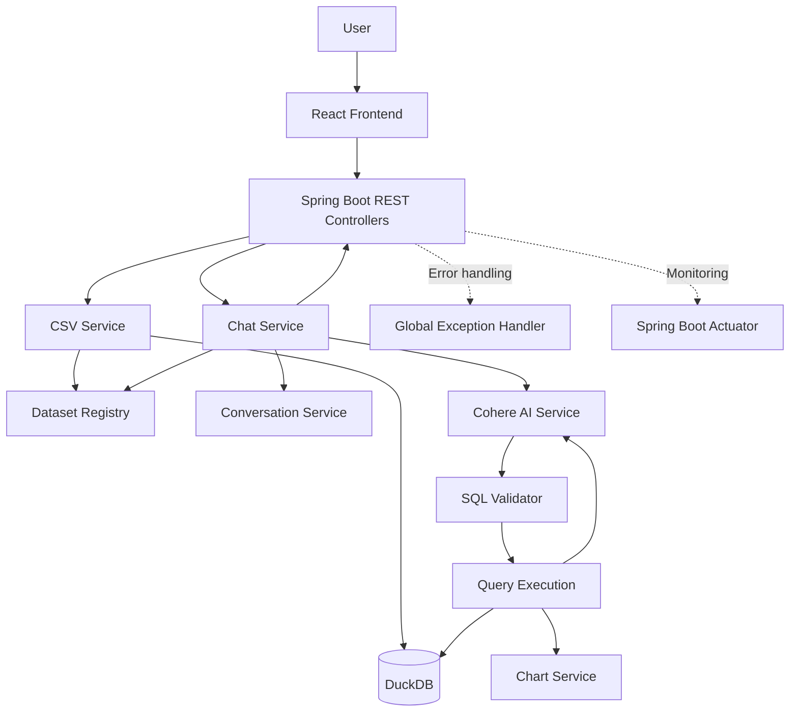
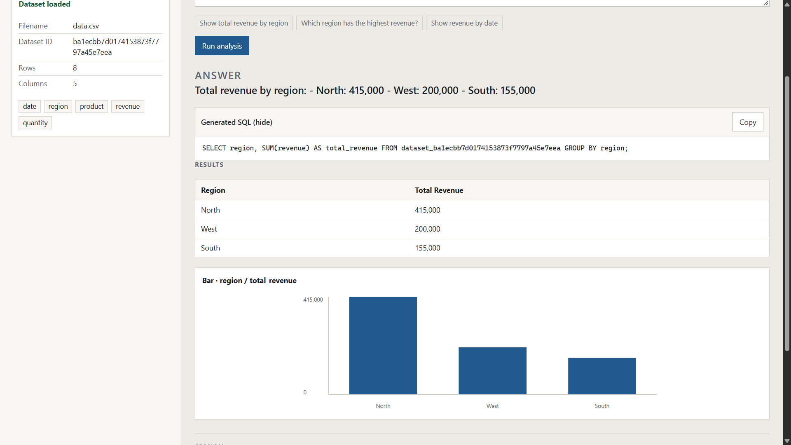

# AI Data Analyst

**Natural-language data analysis powered by Java, Spring Boot, DuckDB, and Cohere.**

AI Data Analyst is an application that allows users to upload CSV datasets, ask questions about their data in natural language, and receive AI-generated explanations backed by executable SQL queries and structured results.

The application combines a Java/Spring Boot backend, DuckDB for analytical query execution, Cohere for language-model capabilities, and a React-based frontend to provide a simple data-analysis workspace.

Instead of manually writing SQL queries, users can ask questions such as:

- What are the total sales?
- Show total revenue by region.
- Which product generated the highest revenue?
- Show revenue by date.
- Which region sold the highest quantity?

The backend translates questions into SQL, validates the generated query, executes it against the selected dataset, and returns the results with a natural-language explanation.

---

## Table of Contents

1. [Project Overview](#project-overview)
2. [Key Features](#key-features)
3. [Technology Stack](#technology-stack)
4. [System Architecture](#system-architecture)
5. [Project Structure](#project-structure)
6. [How the Application Works](#how-the-application-works)
7. [Backend Components](#backend-components)
8. [Frontend](#frontend)
9. [SQL Generation and Validation](#sql-generation-and-validation)
10. [Conversation Context](#conversation-context)
11. [Chart Generation](#chart-generation)
12. [Error Handling](#error-handling)
13. [Observability with Spring Boot Actuator](#observability-with-spring-boot-actuator)
14. [Prerequisites](#prerequisites)
15. [Configuration](#configuration)
16. [Installation and Setup](#installation-and-setup)
17. [Using the Application](#using-the-application)
18. [API Integration](#api-integration)
19. [Testing](#testing)
20. [Data Persistence](#data-persistence)
21. [Security Considerations](#security-considerations)
22. [Current Limitations](#current-limitations)
23. [Future Improvements](#future-improvements)
24. [Author](#author)

---

## Project Overview

Traditional data analysis often requires knowledge of SQL, database schemas, and data-processing tools.

AI Data Analyst simplifies this process through a natural-language interface.

A user uploads a CSV file and asks a question. The backend uses the available dataset schema and the question to generate a SQL query through Cohere. The query passes through a validation service before DuckDB executes it.

The application then returns:

- A natural-language answer.
- The SQL query used for the analysis.
- Structured query-result rows.
- Chart metadata when the result is suitable for visualization.

The frontend presents these outputs in a single workspace, allowing users to inspect the answer, query, and supporting data.

### Example

**User question**

"What are the total sales?"

**Generated SQL**

```sql
SELECT SUM(revenue) AS total_sales
FROM dataset_<datasetId>;
```

**Example response**

```json
{
  "answer": "The total sales are 770,000.",
  "sql": "SELECT SUM(revenue) AS total_sales FROM dataset_<datasetId>;",
  "data": [
    {
      "total_sales": 770000
    }
  ],
  "chart": null
}
```

The value above is from a previously tested sample response. Actual results depend on the uploaded dataset.

---

## Key Features

### 1. CSV Upload and Dataset Registration

- Upload CSV datasets through the frontend.
- Send uploaded files to the existing Spring Boot upload API.
- Validate uploaded files in the backend.
- Assign a unique dataset identifier.
- Load CSV data into DuckDB.
- Register datasets for subsequent analysis.
- Restore datasets from persisted CSV files during application startup.

### 2. Natural-Language Queries

Users can interact with uploaded datasets using ordinary questions rather than writing SQL manually.

Examples include:

- Calculate total revenue.
- Group revenue by region.
- Compare product performance.
- Analyze quantities sold.
- Investigate date-based trends.

The application uses the dataset's available columns to guide SQL generation.

### 3. AI-Powered SQL Generation

Cohere generates SQL queries from:

- The user's question.
- The selected dataset's table name.
- The available column names.
- Previous conversation context.

The generated SQL is returned by the backend and can be inspected through the frontend.

### 4. Analytical Query Execution

DuckDB executes validated SQL queries against the registered dataset.

The backend returns query results as structured rows, making them suitable for rendering as a dynamic table or visualization.

### 5. AI-Generated Answers

After executing the query, the application sends the question, SQL, and actual query results to Cohere to generate a concise natural-language explanation.

The answer-generation prompt instructs the model to use the supplied result and avoid inventing numbers.

### 6. Conversation Context

The application accepts a `sessionId` to associate questions with a conversation.

Previous questions, SQL queries, and answers are stored in an in-memory conversation service and used to interpret follow-up questions.

### 7. Chart Metadata

A dedicated chart service inspects query results and derives visualization metadata when appropriate.

The response can include a chart type, X-axis field, and Y-axis field. The frontend can use this metadata and the actual query results to render a chart.

When a result contains only one aggregate value, the chart may correctly be `null`.

### 8. Centralized Exception Handling

A global exception handler provides consistent JSON responses for handled application errors, including validation failures and unexpected exceptions.

### 9. Application Monitoring

Spring Boot Actuator is configured to expose health, information, and runtime metrics endpoints.

### 10. Frontend Workspace

The React-based frontend provides a simple interface for uploading datasets, asking questions, viewing AI answers, inspecting generated SQL, and examining result rows.

---

## Technology Stack

| Technology | Purpose |
|---|---|
| Java 21 | Backend programming language |
| Spring Boot | Backend framework and dependency injection |
| Spring Web MVC | REST API development |
| DuckDB | Analytical SQL engine |
| DuckDB JDBC | Java connectivity to DuckDB |
| Cohere API | SQL generation and natural-language answers |
| Jackson | JSON parsing and serialization |
| Maven | Dependency management and build automation |
| JUnit 5 | Automated tests |
| Spring Boot Actuator | Health checks and runtime metrics |
| React | Frontend user interface |
| Vite | Frontend development server and build tooling |
| TypeScript | Frontend type safety, if enabled in the current frontend |

---

## System Architecture

The application uses a layered architecture in which each component has a specific responsibility.



### Architecture Overview

**Frontend:** Collects user input and renders backend responses.

**REST controllers:** Handle incoming HTTP requests and return API responses.

**Services:** Coordinate CSV processing, SQL generation, validation, execution, conversation context, and chart metadata.

**DuckDB:** Executes analytical queries against the loaded datasets.

**Cohere:** Provides SQL-generation and natural-language-answer capabilities.

**Actuator:** Exposes configured application health and metrics endpoints.

---

## Project Structure

The backend is organized as a Maven-based Spring Boot application. The frontend is maintained separately in the `frontend/` directory.

```text
ai-data-analyst/
├── .mvn/
├── data/
│   ├── uploads/
│   └── analytics.duckdb
├── src/
│   ├── main/
│   │   ├── java/
│   │   │   └── com/
│   │   │       └── ayush_singh/
│   │   │           └── ai_data_analyst/
│   │   │               ├── Controller/
│   │   │               ├── Service/
│   │   │               ├── Model/
│   │   │               ├── Exception/
│   │   │               └── AiDataAnalystApplication.java
│   │   └── resources/
│   │       └── application.yml
│   └── test/
├── frontend/
│   ├── src/
│   ├── package.json
│   ├── index.html
│   └── vite.config.ts
├── .env
├── .gitignore
├── mvnw
├── mvnw.cmd
├── pom.xml
└── README.md
```

This is a representative structure based on the project layout discussed during development. Keep the actual filenames and directories in your repository if they differ.

The `data/` directory contains runtime data. Its database and uploaded files should generally be excluded from version control.

---

## How the Application Works

The core workflow is:

**Upload CSV → Register dataset → Ask question → Generate SQL → Validate SQL → Execute query → Generate answer → Return results and chart metadata.**

### Step 1: Upload a CSV

The frontend sends the selected file to the backend's CSV upload endpoint.

The backend validates the upload and stores the file under the configured upload directory.

### Step 2: Load the dataset into DuckDB

The CSV service creates or loads a DuckDB table for the dataset and registers its unique dataset ID.

### Step 3: Submit a question

The frontend sends a request containing:

- `sessionId`
- `datasetId`
- `question`

The chat service resolves the dataset and retrieves its column names.

### Step 4: Generate SQL using Cohere

The AI service sends the dataset schema, user question, and available conversation context to Cohere.

Cohere returns a proposed SQL query.

### Step 5: Validate the query

The SQL validator checks the generated query against the current safety rules.

Only queries that pass the checks proceed to execution.

### Step 6: Execute the SQL

DuckDB executes the validated query and returns the result rows.

### Step 7: Generate a natural-language answer

Cohere receives the user's question, executed SQL, and actual result data to produce a concise explanation.

### Step 8: Generate chart metadata

The chart service inspects the result rows and derives metadata when a chart is appropriate.

### Step 9: Return the response

The backend returns the answer, executed SQL, data rows, and chart metadata to the frontend.

### Step 10: Update session context

The backend stores the question, SQL, and answer in the in-memory conversation associated with the session ID.

---

## Backend Components

### CSV Service

Responsibilities:

- Validate CSV uploads.
- Save uploaded files.
- Generate dataset identifiers.
- Load CSV contents into DuckDB.
- Register datasets for later analysis.

### DuckDB Service

Responsibilities:

- Connect to the file-backed DuckDB database.
- Load CSV files as database tables.
- Retrieve column metadata.
- Execute SQL queries.
- Return result rows in a structured format.

### Dataset Registry

Responsibilities:

- Map dataset identifiers to table names.
- Resolve the selected dataset during a chat request.
- Restore registered datasets from persisted CSV files at startup.

### AI Service

The AI service communicates directly with Cohere through the REST API.

It provides two primary operations:

**SQL generation**

Uses the table name, available columns, conversation context, and current question to request SQL.

**Answer generation**

Uses the question, executed SQL, and actual query results to request a natural-language answer.

The model is configured through `application.yml` and an environment variable for the API key.

### SQL Validator Service

Responsibilities:

- Reject empty SQL.
- Allow queries starting with `SELECT` or `WITH`.
- Reject a set of prohibited SQL keywords.
- Confirm the expected dataset table is referenced.
- Remove surrounding SQL code fences.

These checks are basic safeguards rather than a complete SQL security system.

### Chat Service

The chat service coordinates the analysis pipeline:

1. Resolve the dataset.
2. Retrieve its schema.
3. Load conversation context.
4. Generate SQL.
5. Validate SQL.
6. Execute the query.
7. Generate chart metadata.
8. Generate the answer.
9. Update conversation history.
10. Return the response.

### Conversation Service

Stores conversation messages in an in-memory, thread-aware data structure keyed by session ID.

### Chart Service

Derives chart metadata from the result rows without asking the LLM to fabricate chart values.

### Global Exception Handler

Centralizes handled exceptions and returns structured JSON error responses.

---

## Frontend

The frontend provides a single-page analytics workspace rather than a marketing landing page.

### Dataset Upload Panel

Allows users to upload a CSV file and displays dataset information returned by the backend, such as filename, dataset ID, row count, column count, and available columns when provided.

### Question Input

Allows users to submit natural-language questions about the currently loaded dataset.

Example questions include:

- Show total revenue by region.
- Which region has the highest revenue?
- Show revenue by date.

### Answer Panel

Displays the natural-language answer returned by the backend.

### Generated SQL

Displays the executed SQL query in a code-style section and provides a copy action.

### Results Table

Renders columns dynamically from the keys in the returned `data` rows instead of relying on hardcoded column names.

### Visualization

Renders a chart when chart metadata is present and the frontend supports the returned chart type. It uses the actual backend result rows.

If the backend returns `chart: null`, the frontend should not display an empty chart.

### Session History

Displays the questions and answers associated with the current analysis session.

---

## SQL Generation and Validation

The application treats generated SQL as untrusted input and validates it before execution.

The current validator:

- Requires a nonempty query.
- Allows `SELECT` and `WITH` query prefixes.
- Rejects certain data-modification and schema-management keywords.
- Checks that the expected dataset table is referenced.
- Cleans surrounding SQL code fences.

### Limitations

The validator uses basic string checks rather than a complete SQL parser. SQL comments, quoting, nested statements, and other syntax may bypass simple checks.

The current checks should therefore not be treated as a complete security boundary. A production deployment should consider SQL parsing, strict table and column allowlists, query timeouts, resource limits, and a restricted execution environment.

---

## Conversation Context

Each chat request includes a session identifier.

Example request:

```json
{
  "sessionId": "analysis-session-1",
  "datasetId": "<dataset-id>",
  "question": "Show total revenue by region"
}
```

A follow-up request can reuse the same session ID:

```json
{
  "sessionId": "analysis-session-1",
  "datasetId": "<dataset-id>",
  "question": "Which region performed best?"
}
```

The backend uses stored conversation messages to help interpret follow-up questions.

### Current behavior

- Conversation history is stored in memory.
- The same session ID should be reused during a conversation.
- Session history is lost when the application restarts.
- Session IDs are conversation identifiers, not authentication credentials.

---

## Chart Generation

The backend returns chart metadata alongside the result data.

Example:

```json
{
  "chart": {
    "type": "bar",
    "xAxis": "region",
    "yAxis": "total_revenue"
  }
}
```

The frontend uses these fields to select the chart type and map the actual result rows to the chart axes.

For example, a grouped query such as revenue by region can produce a categorical comparison.

A scalar aggregation such as total revenue may return:

```json
{
  "data": [
    {
      "total_revenue": 770000
    }
  ],
  "chart": null
}
```

This is expected because a single aggregate value does not provide a meaningful category axis.

The current chart-selection logic is intentionally basic and should be described as supporting only the types actually implemented and verified.

---

## Error Handling

The global exception handler returns structured errors for handled failures.

The response model follows this structure:

```json
{
  "error": "BAD_REQUEST",
  "message": "Dataset not found",
  "timestamp": "2026-10-09T12:00:00"
}
```

The values above are illustrative.

The frontend should display the returned error message when appropriate and provide a useful message for network failures.

The backend should not expose stack traces, API keys, or other sensitive details in public error responses.

---

## Observability with Spring Boot Actuator

Spring Boot Actuator is configured to expose the following endpoints:

| Endpoint | Purpose |
|---|---|
| `/actuator/health` | Application health status |
| `/actuator/info` | Configured application information |
| `/actuator/metrics` | Available runtime metrics |

Relevant configuration:

```yaml
management:
  endpoints:
    web:
      exposure:
        include: health,info,metrics
  endpoint:
    health:
      show-details: always
```

### Health Check

Start the backend and visit:

`http://localhost:8080/actuator/health`

A healthy application should return a status such as:

```json
{
  "status": "UP"
}
```

### Runtime Metrics

Visit:

`http://localhost:8080/actuator/metrics`

This lists available metrics. Individual metric endpoints can be used to inspect supported runtime measurements.

Actuator provides basic operational visibility. It does not itself provide a complete monitoring dashboard or alerting system.

---

## Prerequisites

Install:

- JDK 21
- Git
- Node.js and npm for the frontend
- A Cohere API key
- A terminal and REST client for testing

The Maven wrapper is included in the backend repository.

Verify Java:

```powershell
java -version
```

Verify Maven's Java runtime:

```powershell
.\mvnw.cmd -version
```

Both should use Java 21.

---

## Configuration

### Cohere API Key

The backend expects the `COHERE_API_KEY` environment variable.

In Windows PowerShell:

```powershell
$env:COHERE_API_KEY = "YOUR_COHERE_API_KEY"
```

This sets the key for the current terminal session.

The relevant configuration in `application.yml` is:

```yaml
spring:
  application:
    name: ai-data-analyst

cohere:
  api-key: ${COHERE_API_KEY}
  model: command-a-plus-05-2026

management:
  endpoints:
    web:
      exposure:
        include: health,info,metrics
  endpoint:
    health:
      show-details: always
```

Never commit a real API key to the repository.

---

## Installation and Setup

### 1. Clone the Repository

```bash
git clone <YOUR_GITHUB_REPOSITORY_URL>
cd ai-data-analyst
```

Replace the placeholder with your actual repository URL.

### 2. Run Backend Tests

```powershell
.\mvnw.cmd clean test
```

### 3. Start the Backend

```powershell
.\mvnw.cmd spring-boot:run
```

The backend should be available at:

`http://localhost:8080`

Keep the backend terminal running while testing the frontend.

### 4. Start the Frontend

Open a second terminal:

```powershell
cd frontend
npm install
npm run dev
```

Vite commonly starts at:

`http://localhost:5173`

Use the actual URL printed by the Vite development server if the port differs.

### 5. Configure Frontend-to-Backend Communication

Ensure the frontend API client points to the running backend.

If the frontend uses Vite environment variables, a local configuration may look like:

```dotenv
VITE_API_BASE_URL=http://localhost:8080
```

The API client must actually read this variable for the setting to take effect.

If the frontend runs on a different origin, the backend must allow that origin through its CORS configuration.

---

## Using the Application

1. Start the backend.
2. Start the frontend.
3. Open the frontend in your browser.
4. Upload a CSV file.
5. Wait for the backend to register the dataset.
6. Enter a natural-language question.
7. Submit the question.
8. Review the generated answer.
9. Inspect the generated SQL.
10. Examine the structured result rows.
11. Review the chart when suitable chart metadata is returned.
12. Ask follow-up questions using the same session.

### Recommended Test Questions

For a dataset containing `date`, `region`, `product`, `revenue`, and `quantity` columns:

**Basic aggregation**

- What is the total revenue?
- What is the total quantity sold?
- What is the average revenue per record?

**Grouped analysis**

- Show total revenue by region.
- Compare revenue across products.
- Show total quantity sold by region.

**Date analysis**

- Show revenue by date.
- Which date had the highest revenue?

The results depend on the uploaded dataset. Grouped queries are particularly useful for testing chart generation.

---

## API Integration

The frontend communicates with the Spring Boot REST API.

### Chat Request Model

The implemented request model contains:

| Field | Description |
|---|---|
| `sessionId` | Conversation identifier |
| `datasetId` | Selected dataset identifier |
| `question` | Natural-language question |

Example:

```json
{
  "sessionId": "test-session-1",
  "datasetId": "<dataset-id>",
  "question": "Show total revenue by region"
}
```

### Chat Response Model

The response contains:

| Field | Description |
|---|---|
| `answer` | Natural-language answer |
| `sql` | Executed SQL query |
| `data` | Structured query-result rows |
| `chart` | Chart metadata or `null` |

### CSV Upload API

The upload endpoint is defined by the existing backend controller. Use the controller's actual HTTP mapping and multipart field name when calling it.

**Before publishing this README, document the exact upload and chat endpoint paths from the controller source code.** They should not be guessed.

---

## Testing

Run all backend tests:

```powershell
.\mvnw.cmd clean test
```

To run the SQL validator test class individually, if it retains the name `SqlValidatorServiceTest`:

```powershell
.\mvnw.cmd -Dtest=SqlValidatorServiceTest test
```

### Manual Verification Checklist

- [ ] Upload a valid CSV file.
- [ ] Verify that the dataset ID is returned.
- [ ] Ask a basic aggregation question.
- [ ] Verify the SQL and result rows.
- [ ] Ask a grouped question and check the chart metadata.
- [ ] Verify that scalar aggregations can return `chart: null`.
- [ ] Verify that the frontend handles empty results.
- [ ] Test an invalid dataset ID.
- [ ] Test follow-up questions using the same session ID.
- [ ] Check `/actuator/health`.
- [ ] Restart the backend and verify dataset restoration.

Passing unit tests does not automatically verify the external Cohere integration. Test the live integration separately with a valid API key.

---

## Data Persistence

The backend uses a file-backed DuckDB database and saves uploaded CSV files under `data/uploads`.

The startup registry scans persisted CSV files and reloads them into DuckDB.

For persistence to work, the runtime database and CSV files must remain available and accessible to the application.

### Git Hygiene

The following runtime files should generally be excluded from version control:

```gitignore
.env
target/
data/uploads/
data/*.duckdb
data/*.duckdb.wal
frontend/node_modules/
frontend/dist/
.idea/
*.iml
```

Keep any intentional sample dataset separate from runtime uploads if you want to include it in the repository.

---

## Security Considerations

- Store API keys in environment variables.
- Do not commit `.env` files containing real secrets.
- Treat LLM-generated SQL as untrusted input.
- Use stronger SQL validation before exposing the application to untrusted users.
- Apply reasonable upload-size and file-validation limits.
- Restrict CORS to trusted origins.
- Review Actuator health-detail exposure before deployment.
- Do not treat session IDs as authentication credentials.

The current application is an assignment-oriented implementation and should not be considered production-hardened solely because it validates SQL and uses a centralized exception handler.

---

## Current Limitations

The current scope focuses on the core analytical workflow.

| Capability | Current implementation |
|---|---|
| CSV upload | Implemented |
| Dataset registration | Implemented |
| DuckDB analytical queries | Implemented |
| Cohere SQL generation | Implemented |
| SQL validation | Basic validation rules |
| Natural-language answers | Implemented |
| Conversation context | In-memory |
| Structured result rows | Implemented |
| Chart metadata | Basic rule-based generation |
| Global exception handling | Implemented |
| Actuator health and metrics | Configured |
| React frontend | Implemented separately |
| Persistent conversation history | Not implemented |
| Authentication and authorization | Not implemented |
| Redis caching | Not implemented |
| Forecasting and anomaly detection | Not implemented |

---

## Future Improvements

Potential extensions include:

- Stronger SQL parsing and query restrictions.
- Improved chart selection and visualization support.
- Persistent conversation history.
- Data-quality checks and anomaly explanations.
- Multi-file analysis.
- Authentication and authorization.
- Exporting query results.
- Automated integration tests.
- Containerized deployment and production monitoring.

These are possible future enhancements and are not claimed as current functionality.

---

## Project Pictures


## Author

**Ayush Singh**

GitHub: [AyushInKC](https://github.com/AyushInKC)

---

Built with Java, Spring Boot, DuckDB, Cohere, and React.
